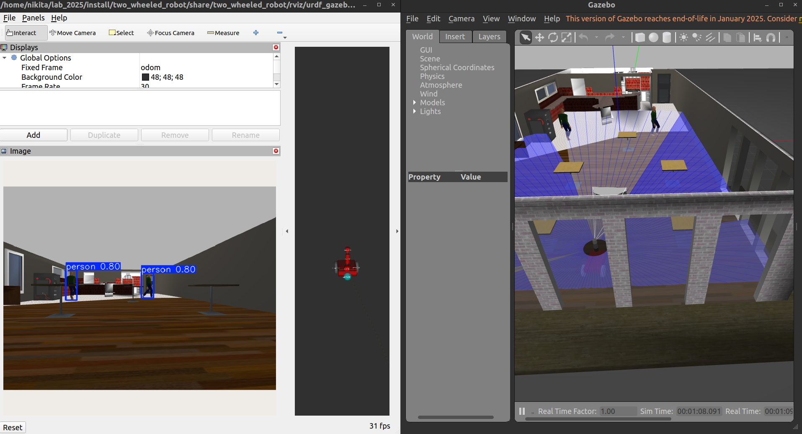

# Лабораторная работа №2 - 2025 🎓

В данной лабораторной работе необходимо запустить проект, ознакомиться с его структурой и ключевыми файлами для выполнения индивидуального задания (Задание №2, вариант у преподавателя).

🔗 **Проект на GitHub:** [github.com/KulikovNA/lab_2025](https://github.com/KulikovNA/lab_2025)  
📁 **Полезные файлы:** [Яндекс.Диск](https://disk.yandex.ru/d/7RAXvA5ataLGyg)


# Задание №1 📝

Запустите проект, ознакомьтесь с его структурой и ключевыми файлами для выполнения индивидуального задания.

---


### Запуск без Docker 🚀

1. **Скачивание репозитория с GitHub**: 📥

```bash
# Загрузка репозитория
git clone https://github.com/KulikovNA/lab_2025.git
```

2. **Добавление предварительно обученных весов** 📦

Скачайте с [Яндекс.Диска](https://disk.yandex.ru/d/zmiA_Qcp2xPcGQ) предварительно обученные веса `yolo11n.pt` и поместите их по пути:
```
~/lab_2025/src/cv_basics/data/yolo11n.pt
```

Или же скачайте веса сразу с репозитория utlralytics и разместите их в нужном месте одной командой:

```bash
wget https://github.com/ultralytics/assets/releases/download/v8.3.0/yolo11n.pt -O ~/lab_2025/src/cv_basics/data/yolo11n.pt
```


3. **Инициализация и сборка проекта** 🔨

```bash
cd ~/lab_2025
colcon build 
. install/setup.bash
```

4. **Установка зависимостей** 🔧

```bash
sudo apt-get update && sudo apt-get upgrade -y && sudo apt-get install -y \
  ros-humble-graph-msgs \
  ros-humble-rviz-visual-tools \
  ros-humble-xacro \
  ros-humble-robot-state-publisher \
  ros-humble-joint-state-publisher \
  ros-humble-joint-state-publisher-gui \
  python3-pip \
  ros-humble-gazebo-* && \
pip3 install cv_bridge pyzmq zmq ultralytics

pip3 install 'numpy==1.26.4'
```

5. **Запуск симуляции и модели** 🚀

```bash
ros2 launch two_wheeled_robot launch_sim_cv.launch.py
```

В RVIZ нажмите “Add” → добавьте топик `/video_with_predict/Image`. 👀

---

### Запуск с Docker 🐳

1. **Предварительная загрузка Docker-образа** 📦

Скачайте с [Яндекс.Диска](https://disk.yandex.ru/d/o00WF9BmRjbnqA) tar образ Dockers/docker_image_base/base_docker_lab2.tar. Загрузка и сборка Docker-образа

```bash
docker load -i base_docker_lab2.tar
```

2. **Скачайте репозиторий** 📥

```bash
git clone https://github.com/KulikovNA/lab_2025.git
```

3. **Добавьте веса** 📦

Скачайте `yolo11n.pt` с [Яндекс.Диска](https://disk.yandex.ru/d/zmiA_Qcp2xPcGQ) и поместите по пути:
```
~/lab_2025/src/cv_basics/data/yolo11n.pt
```
Или же скачайте веса сразу с репозитория utlralytics и разместите их в нужном месте одной командой:

```bash
wget https://github.com/ultralytics/assets/releases/download/v8.3.0/yolo11n.pt -O ~/lab_2025/src/cv_basics/data/yolo11n.pt
```

4. **Сборка и запуск контейнера** 🔨

```bash
cd ~/lab_2025/docker
bash build_lab_2_docker.sh
bash run_docker_lab2.sh
```

После запуска — откройте RVIZ, нажмите “Add” и выведите топик `/video_with_predict/Image`. 👀

---

### Результат 🎉

Рисунок 1 — результат работы приложения (окно RVIZ с предиктами ML-модели)




# Задание №2 💡

Сформируйте группы из 3-х человек и получите вариант с заданием у преподавателя. От группы нужно будет загрузить решение на GitHub в отдельную ветку. Для этого выполните следующие действия:

---

## Настройка GitHub 🔑

1. **Регистрация и проверка SSH-ключей** 🔍

   - Зарегистрируйтесь на [GitHub](https://github.com) и настройте профиль для загрузки данных.
   - Проверьте наличие ключей:
     ```bash
     ls ~/.ssh/id_*.pub
     ```
   - Если у вас уже есть файл `id_ed25519.pub` или `id_rsa.pub`, переходите к шагу 3.

2. **Генерация нового SSH-ключа** 🔐

   - Если ключ отсутствует, выполните:
     ```bash
     ssh-keygen -t ed25519
     ```
   - Если ваша система не поддерживает Ed25519, используйте:
     ```bash
     ssh-keygen -t rsa -b 4096
     ```
   - Просто нажимайте Enter, чтобы принять стандартные пути.

3. **Копирование публичного ключа** 📄

   - Выполните:
     ```bash
     cat ~/.ssh/id_ed25519.pub   # или используйте id_rsa.pub
     ```
   - Скопируйте весь текст, начиная с `ssh-ed25519` (или `ssh-rsa`) и до вашего email.

4. **Добавление ключа в GitHub** ✏️

   - Перейдите в профиль GitHub → **Settings** → **SSH and GPG keys**.
   - Нажмите **New SSH key**, вставьте скопированный ключ в поле *Key*, задайте название (например, `laptop`) и сохраните.

5. **Проверка подключения** 📶

   - Проверьте подключение:
     ```bash
     ssh -T git@github.com
     ```

---

## Работа с репозиторием 🐙

1. **Форк и клонирование репозитория** 📥

   - Перейдите на страницу репозитория: [https://github.com/KulikovNA/lab_2025](https://github.com/KulikovNA/lab_2025) и нажмите **Fork**.
   - После форка у вас появится копия репозитория по адресу:
     ```
     https://github.com/<username>/lab_2025
     ```
   - Клонируйте репозиторий по SSH:
     ```bash
     git clone git@github.com:<username>/lab_2025.git
     ```

2. **Создание ветки, коммиты и пуш изменений** 🌿

   - Создавайте ветку, коммитите и пушьте изменения. Назовите ветку по шаблону: `student-<Фамилия>-<Vвариант>`.
   - Пример:
     ```bash
     cd ~/lab_2025
     git checkout -b student-Kulikov-V9 
     # ... Решаете задачку ... 
     git add .
     git commit -m "Мы молодцы: задание решено"
     git push origin student-Kulikov-V9
     ```
   - **Важно!** Перед загрузкой решения (push) добавьте все используемые зависимости (библиотеки и репозитории, которые подгружались) в файл:
     ```
     ~/lab_2025/docker/Dockerfile.lab_2
     ```

3. **Создание Pull Request** 🤝

   - Создайте Pull Request из вашей ветки `student-<Фамилия>-<Vвариант>` в ветку `main` репозитория [KulikovNA/lab_2025](https://github.com/KulikovNA/lab_2025).
   - Для создания Pull Request:
     - Зайдите в ваш форк на GitHub.
     - Перейдите во вкладку **Pull requests** → **New pull request**.
     - Выберите базовую ветку `KulikovNA/lab_2025:main` и вашу ветку `student-<username>-V9`.


# ВАРИАНТЫ 🚀

## Вариант №1: Замена модели мобильной платформы
**Задание:**  
Заменить модель трехколесной мобильной платформы на модель мобильного робота с манипулятором Kuka Youbot, разместить на его платформе стойку с камерой, а затем повторить реализацию системы локализации объектов на изображении с участием робота Kuka Youbot.

**Рекомендации:**
- Использовать базовый репозиторий `two_wheeled_robot` как шаблон;
- Взять из первой лабораторной готовую URDF-модель Kuka Youbot (например, из пакета `youbot_description`);
- Добавить камеру с топиком `/camera/image_raw`, подключить ML-модель из Ultralytics;
- Настроить RVIZ для отображения данных с камеры;
- Провести симуляцию в Gazebo.

---

## Вариант №2: Замена ML-модели на модель сегментации с ONNX
**Задание:**  
Заменить в системе ML-модель детектирования объектов на модель сегментации с использованием библиотеки Ultralytics. Сконвертировать полученную модель в формат ONNX, изменить мир симуляции на "Car" и разместить робота в области с наибольшим количеством объектов интереса (машин), добавить людей в мир симуляции.

**Рекомендации:**
- Использовать модель `yolo11n-seg` от Ultralytics;
- Конвертировать модель в формат ONNX с помощью `model.export(format="onnx")`;
- Использовать ONNX Runtime для инференса в ROS2-ноде;
- Подключить вывод сегментированных масок к RVIZ через `MarkerArray`;
- Использовать мир `car.world`.

---

## Вариант №3: Телеуправление – управление роботом с клавиатуры
**Задание:**  
Добавить возможность управления движением мобильной платформы с помощью клавиатуры.

**Рекомендации:**
- Использовать ROS2-пакет `teleop_twist_keyboard`;
- Настроить публикацию в топик `/cmd_vel` (тип `geometry_msgs/Twist`);
- Подключить RVIZ для отображения робота.

---

## Вариант №4: Система SLAM с фильтрацией динамических объектов
**Задание:**  
Реализовать SLAM на основе камеры и лидара. Интегрировать ML-модель сегментации для фильтрации движущихся объектов.

**Рекомендации:**
- Использовать `rtabmap_ros` или `cartographer_ros2` для SLAM;
- Подключить ML-модель сегментации объектов (`yolo11n-seg`);
- Исключить пиксели с сегментированными объектами при обновлении карты;
- Для лидара использовать топик `/scan`, для камеры — `/camera/image_raw`;
- Использовать RVIZ для отображения карты и текущей позиции.

---

## Вариант №5: Автономное хаотичное движение с обходом препятствий
**Задание:**  
Настроить автономное движение робота в произвольном направлении с динамическим обходом препятствий.

**Рекомендации:**
- Использовать nav2 с алгоритмом TEB или DWA;
- Обработка данных лидара из топика `/scan` для построения карты препятствий;
- Использовать random goal generator для задания случайных точек в пределах карты;
- Публиковать цели в топик `/goal_pose` (тип `geometry_msgs/PoseStamped`).

---

## Вариант №6: Конвертация ML-модели в формат ONNX
**Задание:**  
Конвертировать текущую модель `yolo11n` из Ultralytics в ONNX и организовать инференс в ROS2-ноде.

**Рекомендации:**
- Использовать команду `{yolo export ...}` в Ultralytics;
- ONNX Runtime – как бекенд для запуска инференса в ROS2;
- Подключение к топику `/camera/image_raw`, публикация результатов – в топик `/detections`.

---

## Вариант №7: Модуль отслеживания объекта в реальном времени
**Задание:**  
Реализовать отслеживание выбранного объекта в реальном времени, управляя положением камеры или платформы.

**Рекомендации:**
- Использовать `yolo11n` в сочетании с алгоритмом трекинга (например, SORT или подобный);
- Центрирование объекта по координатам Bounding Box;
- Использовать топики: `/camera/image_raw` (вход), `/cmd_vel` (движение), `/object_pose` (позиция объекта);
- Для RVIZ использовать `Marker` для отображения позиции объекта.

---

## Вариант №8: Мультимодальный анализ с использованием камеры и лидара
**Задание:**  
Реализовать определение объектов и расстояний до них с помощью камеры и лидара.

**Рекомендации:**
- Использовать `yolo11n` для детекции объектов на изображении;
- Использовать топик `/scan` для получения расстояний до границ объектов;
- Сопоставить bounding box и ближайший лазерный луч по координате X;
- Вывод данных в RVIZ через `MarkerArray` с подписями: класс + расстояние.

---

## Вариант №9: Object follower с использованием готового репозитория
**Задание:**  
Использовать `follow_object` для реализации с логикой переориентации при потере объекта.

**Рекомендации:**
- Интегрировать Ultralytics-модель (`yolo11n`);
- Входной топик `/camera/image_raw`, выходной топик `/cmd_vel`;
- Переориентация – вращение на месте при отсутствии объекта;
- Проверить параметры в launch-файле (topics, модель, режим следования);
- Использовать RVIZ для отладки позиции объекта и робота.

---

## Вариант №10: Взаимодействие двух роботов – обнаружение и наведение
**Задание:**  
Один робот обнаруживает объекты, второй – получает координаты и движется к ним, измеряя расстояние с помощью лидара.

**Рекомендации:**
- Запустить двух роботов в одном мире Gazebo (использовать namespace и `robot_state_publisher` для каждого);
- Первый робот публикует позицию объекта в топик `/detected_object_pose` (тип `geometry_msgs/PoseStamped`);
- Второй робот подписывается на координаты и использует топик `/scan` для оценки расстояния и безопасного приближения;
- Навигация осуществляется через топик `/cmd_vel` с расчётом дистанции до цели на основе данных лидара;
- Использовать RVIZ для отображения траектории движения, текущих позиций и цели.
